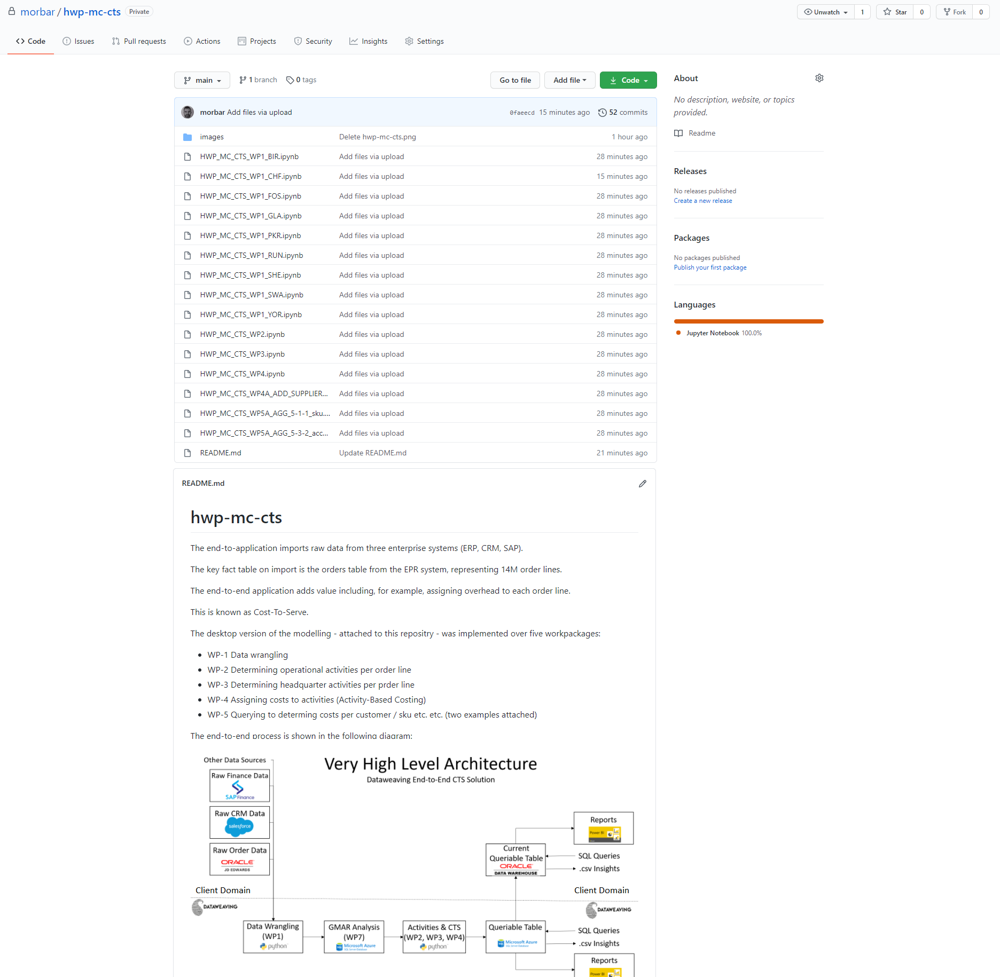

# public
Note about my commercial code.

My current substantive code is commercial and I unable to make any of those repositries public.

I attach a screenshot below of a readme.md file from one of my private commercial repositries.

I am happy to invite interested parties to as collaborators that repositry in order for them to check it out.

